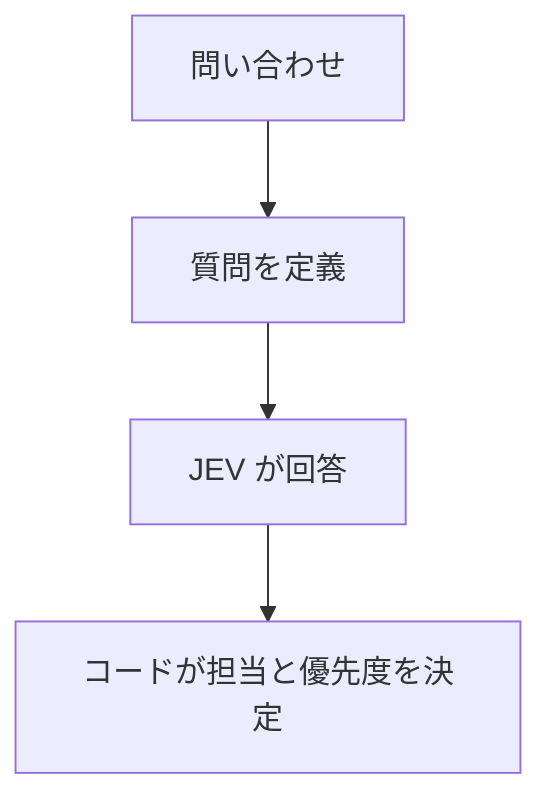

# JEV 入門: 問い合わせを分類してみましょう

この見本では、問い合わせを JEV に読み取ってもらい、担当と優先度を表示します。文章に対して質問を定義し、AI の回答をコードで使う流れを学べます。

| 用語 | 説明 |
| --- | --- |
| JEV | この見本で `jev-latest` というモデル名で呼び出す AI です。 |
| TypeSafe AI | JEV をプログラムから利用するためのサービスです。 |
| SDK | 外部サービスを呼び出しやすくする部品です。ここでは `@typesafe-ai/sdk` を使います。 |
| API キー | サービスを利用するための秘密の認証情報です。 |
| Node.js / npm | Node.js はコードを動かすソフトウェア、npm は必要な部品を準備するツールです。 |
| 質問 / 回答 | 質問は AI に判断してほしい内容、回答は選択肢や数値で返る判断結果です。 |
| 確信度 | AI が判断について報告する値です。実際の正解率を保証する値ではありません。 |

## 学ぶこと

自由な文章のままでは、担当や優先度をコードで決めにくい場合があります。この見本では、AI に担当・緊急度・不満度を質問します。その回答を使って、コードが振り分けを決めます。



## 利用上の注意

このチュートリアルでは、架空の問い合わせを使ってください。入力内容は外部の TypeSafe AI に送信されます。個人情報や秘密情報を入力しないでください。

## 1. 準備する

Node.js 22 以降と、TypeSafe AI の API キーを用意してください。コマンドは、このフォルダーでターミナルに入力します。

必要な部品を準備し、[example.env](example.env) から設定用の `.env` を作ります。既にある `.env` は上書きしません。

```bash
npm ci
cp -n example.env .env
```

`.env` の次の項目に、自分の API キーを設定してください。以下は記入例であり、本物のキーではありません。

```dotenv
TYPESAFE_API_KEY=自分のAPIキー
```

API キーは他の人に送ったり、Git に登録したりしないでください。

## 2. 会話形式で試す

```bash
npm start
```

`A>` の後に問い合わせを入力し、Enter キーを押してください。一度の実行で、一件を分類します。

次は、このチュートリアル用に作った表示例の一部です。実際の結果は AI の判断によって変わります。

```text
Q>お問い合わせはなんでしょうか
A> ログインできません。今日中に確認してください。

結果
{
	"問い合わせ": "ログインできません。今日中に確認してください。",
	"担当": "技術サポート",
	"優先度": "高"
}
```

実際の AI を呼ぶため、API キーとネット接続が必要です。空入力では分類しません。

**入力内容は外部の TypeSafe AI に送信されます。** 学習には架空の文章を使い、個人情報や秘密情報を入力しないでください。

## 3. 質問と回答を読む

質問の定義は [src/triage.ts](src/triage.ts) の `questions` にあります。この見本では、次の三種類を使っています。

| 関数 | AI に判断してもらう内容 | 回答の読み方 |
| --- | --- | --- |
| `choice` | 最初に担当する部署を、用意した選択肢から選びます。 | `choice` が部署のキー、`confidence` が確信度です。 |
| `noul` | 急いで対応してほしいという要求や期限があるか判断します。 | `noul` は「はい」の確率です。0〜1 の値で、1 に近いほど「はい」寄りです。 |
| `score` | 不満の強さを、順番に並べた説明に沿って評価します。 | `score` が点数、`confidence` が確信度です。 |

この見本の不満度は、0 が落ち着いた状態、1 が不満や困惑、2 が強い怒りや非難に対応します。点数は `1.5` のような小数にもなります。

`evaluateTicket` は、次の処理で問い合わせと質問を JEV に送ります。`client` と `questions` は同じファイルで定義されています。

```typescript
export async function evaluateTicket(ticket: string) {
		return client.systemOne({ model: "jev-latest", state: { ticket }, questions });
}
```

`state` は判断対象の情報、`questions` は質問の集合です。返った回答は `response.answers.department.choice` などで読み取れます。[TypeSafe AI SDK（日付不明）, Quickstart・回答の型定義]

## 4. 優先度の決め方を読む

AI の回答を受けて、`decideRoute` が次の条件を上から順に確認します。最初に当てはまった結果を使います。

| 条件 | 表示する結果 |
| --- | --- |
| 部署が「その他」、または部署の確信度が 0.8 未満 | 担当は「人による確認」、優先度は「要確認」です。 |
| 緊急度が 0.8 以上、または不満度が 1.5 以上かつその確信度が 0.8 以上 | AI が選んだ部署を担当にし、優先度は「高」です。 |
| 緊急度が 0.2 以上、または不満度の確信度が 0.8 未満 | AI が選んだ部署を担当にし、優先度は「要確認」です。 |
| どれにも当てはまらない | AI が選んだ部署を担当にし、優先度は「通常」です。 |

これらの数値は、[src/triage.ts](src/triage.ts) にあるこの見本独自のルールです。JEV 共通の推奨値ではありません。分類に失敗した場合も「人による確認」「要確認」を表示します。

「ログインできません」と「ログインできません。今日中に確認してください」を別々に入力し、緊急度と優先度を比べてみてください。次に質問文を変え、判断にどんな違いが出るか試してみましょう。

## ファイルの役割

| ファイル | 役割 |
| --- | --- |
| [src/triage.ts](src/triage.ts) | AI への質問と振り分けルールを定義します。 |
| [src/run.ts](src/run.ts) | 問い合わせを受け取り、日本語で結果を表示します。 |
| [src/triage.test.ts](src/triage.test.ts) | 架空の AI 回答を使い、振り分けルールを確認します。 |

## コードを確認する

次のコードのテストは架空の AI 回答を使い、外部サービスには接続しません。実際の AI を呼ぶ `npm start` とは別です。

```bash
npm test
npm run typecheck
```

一つ目は担当と優先度の振り分けルールを確認します。二つ目はコードの型の間違いを確認します。AI の分類が正しいかどうかは、これらの検査だけでは確認できません。

## 参考資料

- [TypeSafe AI SDK, 日付不明] TypeSafe AI. TypeSafe AI JavaScript SDK 0.6.0. インストール済み SDK の README と型定義を参照しました。[パッケージ情報](https://www.npmjs.com/package/@typesafe-ai/sdk/v/0.6.0)
- TypeSafe AI の詳しい使い方: [公式ドキュメント](https://docs.typesafe.ai/)
